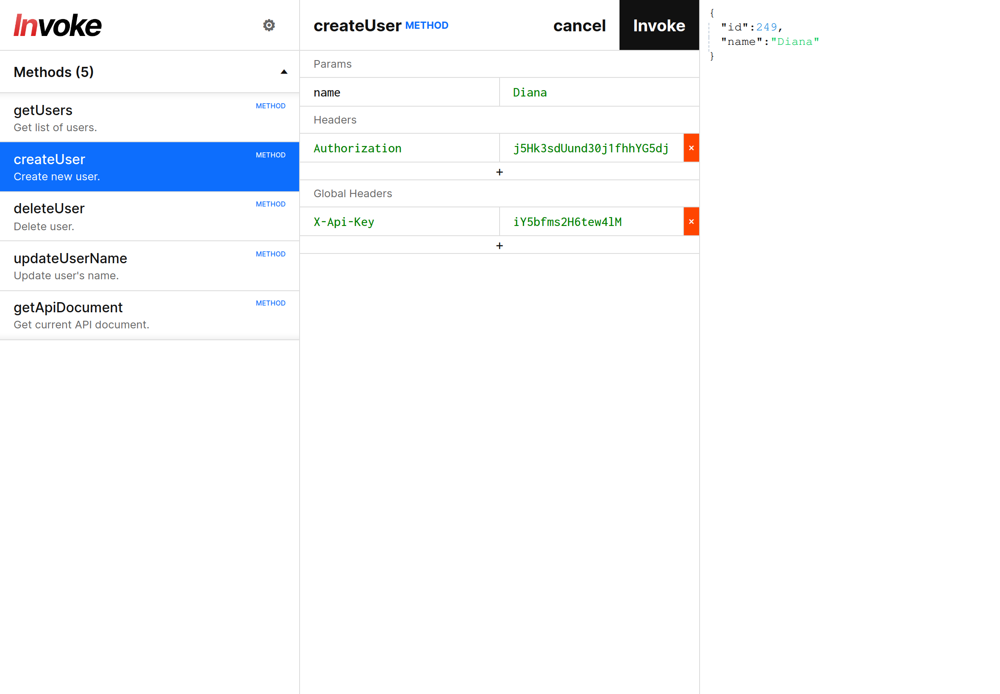

# Invoke Explore

**[Open at storinka.github.io/invoke-explore](https://storinka.github.io/invoke-explore/)**

API Document viewer written in Vue 3.



## Features

- Supports custom name and icon in header
- Supports `MethodDocument`, `SectionDocument`, `TypeDocument`, `IframeDocument`, `MarkdownDocument`
- Supports all simple types
- Supports array type
- Supports typed array type
- Supports union type
- Supports enum type
- Supports binary type
- Supports method-specific headers
- Supports global headers

## How to run

1. Install dependencies:

```shell
yarn install
```

2. Run the project:

```shell
yarn dev
```

## How to build

```shell
yarn build
```
